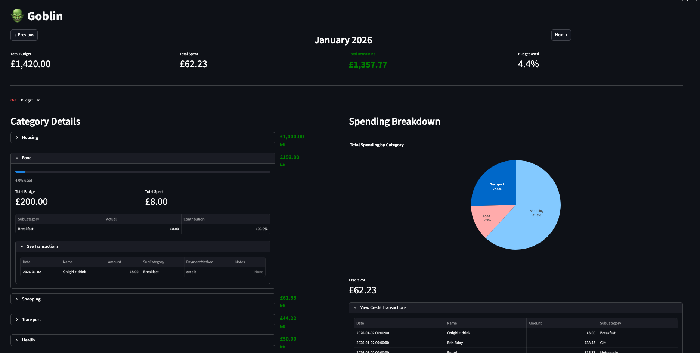

# Goblin Budget Tracker 🧙

A personal budget tracking application built with Streamlit that helps you monitor your spending and stay on top of your financial goals.

## Demo



## Features

- 📊 Interactive spending visualization with charts and graphs
- 💰 Monthly budget tracking by category
- 📈 Real-time budget vs actual spending comparisons
- 💳 Credit card spending tracking
- 📅 Monthly view with easy navigation
- 🎯 Category-wise spending breakdown
- 📱 Responsive web interface

## Installation

1. Clone the repository:
```bash
git clone <repository-url>
cd goblin
```

2. Install dependencies:
```bash
pip install -r requirements.txt
```

3. Set up environment variables:
   - Copy `.envrc.example` to `.envrc` (if it exists)
   - Set `VULKAN_API_URL` and `WELL_API_KEY` for API access

## Usage

### Run with API (Production)
```bash
streamlit run streamlit_budget.py
```

### Run with Test Data
```bash
streamlit run streamlit_budget.py -- --test
```

The app includes test data in the `test/` directory for development and testing purposes.

## Project Structure

- `streamlit_budget.py` - Main Streamlit application
- `vulkan_api.py` - API client for fetching budget and transaction data
- `requirements.txt` - Python dependencies
- `test/` - Test data files
- `goblin-mascot.png` - Application mascot/logo

## Dependencies

- streamlit - Web application framework
- pandas - Data manipulation
- plotly - Interactive charts
- requests - HTTP client for API calls

## Development

The application supports two modes:
1. **API Mode**: Fetches live data from the Vulkan API
2. **Test Mode**: Uses local test data files for development

Use the `--test` flag to run in test mode.